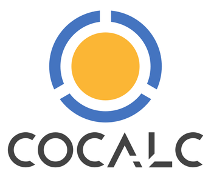

# Introducing Our Tools for Data Science


# Jupyter

[**Jupyter**](https://jupyter.org/) (pronounced like the planet, Jupiter) is a tool that was developed as an open-source project to allow users to run code in a type of file called a **notebook**. A notebook is a file that contains a set of cells. Each cell can contain code; clicking on a code cell and then hitting its "run" button will execute the code. Any results (including graphics, formatted tables, or raw text) will be printed out right below the cell that generated them. Each cell can each contain many lines of code (like small program files), and a notebook can have many cells, each with bits of code. Moreover, notebooks are files, meaning that the entire contents are saved together, and can be reopened and re-run later — making the process reproducible. Perhaps the greatest advantage of notebooks over files containing code, however, is that the output of each cell is saved when the notebook file is saved. This means that you can write code to perform a task, such as analyzing a data set, and have the output right there with the commands that produced the output. Jupyter notebooks have revolutionized the practice of data science, and create an ideal environment for learning and communicating.

Another great feature of notebooks is that cells can contain either code, or text formatted in a simple language called [**Markdown**](https://daringfireball.net/projects/markdown/). This means that in between your code cells, you can write blocks of text, for example to annotate or, essentially, "tell the  story" of your data. Indeed, you could literally write a scientific manuscript in a Jupyter Notebook, with the advantage that it contained all of the reproducible code used to perform the analysis. We'll talk more about Markdown later.

Here's an example screenshot of a notebook file:


Jupyter notebooks have a number of other great design features. For one, notebooks were designed to run through a web browser, which means that you can run, and store, your analyses on a remote server (e.g., one belonging to a lab or university), meaning that you don't have to worry about the storage, backups, or computational capabilities of the computer you're working on (I'm guessing for most of you, this is a not-super-powerful laptop). In fact, there are a number of online cloud services for running Jupyter notebooks that you can use for free, including [Google Collaboratory](https://colab.research.google.com/notebooks/intro.ipynb#recent=true), and [CoCalc](https://cocalc.com/). In the class we will use CoCalc. Cocalc's implementation of Jupyter looks a little different from the screen shot above, but functions very much the same.

Another great feature of notebooks is that they can run code in a wide range of different languages. Indeed, the name "jupyter" comes from the names of the three first programming languages it supported: Julia, Python, and R. There are now over 100 different languages supported in Jupyter notebooks! Typically though, a given notebook file only runs a single language, so you have to pick when you first create the file.

In this class, you will work extensively in Jupyter notebooks, and you will use them to complete and submit your assignments and projects, as well. There are lots of materials on the web to help you learn (or remember) how to use Jupyter notebooks, starting with their official website: [https://jupyter.org](https://jupyter.org). 




# CoCalc

[CoCalc](https://cocalc.com/) is a cloud service that hosts Jupyter notebooks. It is designed for collaboration and for use in class teaching situations. It's pretty awesome. CoCalc uses a "freemium" pricing model, whereby you can use it for free, but get significant improvements in service through a paid plan. SURGE covers the cost of CoCalc for the Discover Coding series, so you will receive access to an upgraded account for free (for the duration of the series you registered for). At the start of the first session, attendees will receive an invitation link sent to the email address they registered with (typically your dal.ca or other school address). Follow this and the instructions to set up your password and other account settings.

At its core, CoCalc allows you to create and run Jupyter notebooks (in a variety of prominent data science languages, including Python, R, and Julia), as well as open and run a terminal, create and edit Markdown files, and even create to-do lists! Each user logs into their own isolated environment, so your files and work are private from other students. Importantly, though, the teaching team will be able to see all of your files and code. They can do this in real time, similar to how people can collaborate "live" on Google Docs. This allows the teaching team to be able to look at your work and help you solve problems when you get stuck (but the teaching team can view all of your files). It's the closest thing to having a teacher come look over your shoulder and point out where you've gone wrong. 

CoCalc also allows Time Travel! It keeps track of every change you've made to a document, so that you can travel back in time if you accidentally delete something, or decide your earlier work was better, etc..  Your dog will never be able to eat your homework, and you will never have to worry about backups, or failed hard drives destroying your work for this class.

You should check out the [CoCalc Student Guide](https://doc.cocalc.com/teaching-students.html).

CoCalc is a great example of the value of open source software. It uses the open-source Jupyter project and free software tools like Python and Markdown. Moreover, it is actually a product of an open source project called SageMath. SageMath is a mathematical software platform that integrates Python, R, and a variety of other languages and tools (and indeed, you can run SageMath from within CoCalc). SageMath was created by mathematician (and skateboarder) [William Stein](https://wstein.org/) in 2005, when he was a professor at Harvard. He held a couple of other university faculty jobs before quitting in 2019 to run SageMath full time. CoCalc is a revenue-generating operation that helps pay his salary and support the ongoing development of SageMath.

There are a lot of other free Jupyter notebook services, including [Google Colaboratory](https://colab.research.google.com/). These are worth knowing about, and you may want to use them for your own projects, or just for playing around, in the future. They don't offer the same great features of CoCalc for classes - in particular for Discover Coding, the ability for members of the teaching team to view your notebooks live during a session, to provide you with help. 

Your account on Cocalc will persist even after the workshop ends. The only difference will be that your paid license will expire, so the performance of your notebooks will suffer (generally be slower). But for the purposes of practicing Python, it should serve you fine. This also means that all the files and work you do in this workshop will be preserved on CoCalc indefinitely, and you can download all the files to your personal computer if you wish. If you really like CoCalc, you can pay to use it yourself after Discover Coding ends. However, if you consider using these for data analysis in the future, be sure that any data you upload is anonymized and so uploading to a public (and likely US-based) server does not violate research ethics or privacy laws.


# Markdown

In addition to code cells, Jupyter notebooks can contain Markdown cells with formatted text, images, and mathematical formulae. [**Markdown**](https://daringfireball.net/projects/markdown/) is a "plain text formatting syntax" and a tool for converting such plain text to a formatted version, such as [HTML](https://en.wikipedia.org/wiki/HTML) for display in a web page. Recall earlier the discussion about plain text (.txt files) versus rich text (such as in Microsoft Word or Google Docs). Rich text files display the text that you enter, and the formatting you choose (e.g., boldface), and hide the information telling your computer to make that text boldface "behind the scenes" in a complex file. In contrast, when you open a plain text file, what you see is literally the contents of that file, with nothing hiding in the background (except for a couple of hidden features, like markers for line breaks and tabs).

So a plain text file can never contain formatting like boldface or italic. Markdown allows you to create a text file with special codes that you type to "mark" certain text for formatting, and then run a program on that text file to produce a formatted output. For example, text surrounded by `*one asterisk*` shows up in *italics*; text surrounded by `**two asterisks**` shows up as **boldface**.

## Different levels of headings
Different levels of headings can be indicated with hash marks; the more hash marks, the more deeply embedded a header is. So, the following:
- `# Heading 1` = first-level heading (like the title at the top of this page)
- `## Heading 2` = second-level heading (like the title of this subsection)
- `### Heading 3` = third-level heading (smaller heading font)
- etc.

While originally Markdown was designed to simplify creating web pages in HTML (the coding language for web pages), there are now a huge number of output formats available (e.g., PDF, Microsoft Word, ePub) in different applications, and many Markdown apps that allow you write and edit Markdown files while viewing a preview of the formatted output in another window alongside your Markdown text file.

HTML — and by extension, Markdown — embodies a design philosophy of separating the content of a document from its formatting. That is, when writing the content, you focus on writing, not how it's going to look, and then later, you apply formatting to make it look a certain way. This means that the same document can be formatted in virtually any possible way, with different fonts, sizes, etc.. It also provides consistency (e.g., you don't have to remember to manually make every first-level heading a specific larger font size, and bold) and makes it very easy to produce professional-looking output without professional web design skills.

As noted earlier, Jupyter notebook cells can also contain Markdown, allowing you to produce rich and professional-looking text alongside your code. So, you will use Markdown a lot in this course in writing up assignments and projects. It's pretty simple and quick to learn. The [official Markdown site](https://daringfireball.net/projects/markdown/syntax) provides thorough documentation on its syntax, although I find this [Markdown Cheatsheet](https://www.markdownguide.org/cheat-sheet/) more efficient for finding the most commonly-needed things — or [this one](https://www.ibm.com/support/knowledgecenter/en/SSGNPV_2.0.0/dsx/markd-jupyter.html) for some extra fancy Markdown you can use in Jupyter notebooks.


# Getting Help with Python

Python is a widely-used language and there is lots of information on the web about it. But, sometimes it's hard to know where to start! The lessons in this course will introduce you to Python, and is meant to be largely self-contained. Many links are provided in the lessons to relevant sites. Once you move beyond this workshop, however, you will have to rely on your wits and online research skills. Below are a few key reference websites.

**Python**, and associated packages, have official documentation. The official documentation for Python is at [https://docs.python.org/3/](https://docs.python.org/3/)

Two core Python packages we'll use are NumPy and pandas.

**NumPy**'s official reference documentation is at [https://numpy.org/doc/1.19/reference/index.html](https://numpy.org/doc/1.19/reference/index.html)

**pandas**' official reference documentation is at [https://pandas.pydata.org/docs/user_guide/index.html#user-guide](https://pandas.pydata.org/docs/user_guide/index.html#user-guide)

However, in practice these reference guides don't provide the easiest entry point for finding the information you probably want, such as "How do I...?" or "What are the options for command X?". More often, doing a search for your question is the best way to get results.

The sites you find in those searches will likely be many, but a common one is [Stack Overflow](https://stackoverflow.com), a huge Q&A site. One of the strengths of Stack Overflow is that it allows users to vote (up or down) questions and answers, which helps in evaluating the quality of these. Stack Overflow also limits whose votes count; only the votes of registered users who have developed a positive reputation on the site are counted. Reputation is gained by asking questions that received positive votes.  

## APIs
One thing you will often find, especially if you're trying to figure out how to use a command or function, is the **application programming interface** (**API**). The API will give you the name of the command, and the different **arguments** it takes. Arguments are bits of information you provide to the command (typically inside parentheses) that are either required for the command to run, or optional extra information. For example, [this is the API for the NumPy command to compute the mean of a set of numbers](https://numpy.org/doc/stable/reference/generated/numpy.mean.html):
`numpy.mean(a, axis=None, dtype=None, out=None, keepdims=<no value>)`

The command itself is the first part before the parentheses (`numpy.mean`) and the arguments are in the parentheses. Each argument is separated by a comma from the other arguments. Required arguments are generally first in the list, and don't include an `=` sign. The arguments with `=` signs are generally optional. The NumPy API at the link above also explains what each argument is; for simplicity here, the `a` is the set of data you want to compute the mean from (which is required; how could the function give you a mean if it didn't have data to do that from?) and the other arguments are all options that might be required to get the result you desire.

APIs may look pretty complicated at first, but they can be very helpful in breaking down a command and understanding how to use it better. By contrast, when you search the web for answers to programming questions, often you'll get example code that shows a particular way to use a function or method. This is also useful, but in order to adapt that to your problem (or understand what it's actually doing), you may want to check the API for that function to learn more.

<font color='blue'>
<h2>Pro Tip:</h2>
When working from examples that you find on the web, resist the temptation to copy and paste them, and instead re-type them yourself. While you may make a few more errors (and it's slower), *it's a much better learning technique*. Although you are, hopefully, reading the code you copy, and trying to understand it, you tend to learn and retain more if you type it out yourself (just like taking notes is more effective than just reading a book or listening to a lecture).
</font>


```python

```
