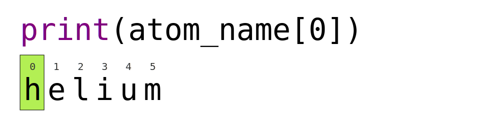

# Data Types and Conversion
---

## Questions:
- What kinds of data do programs store?
- How can I convert one type to another?

## Learning Objectives:
- Explain key differences between integers and floating point numbers.
- Explain key differences between numbers and character strings.
- Use built-in functions to convert between integers, floating point numbers, and strings.

---

## Every value has a type

*   Every value in a program has a specific type
*   Integer (`int`): represents positive or negative whole numbers like 3 or -512
*   Floating point number (`float`): represents real numbers like 3.14159 or -2.5
*   Character (`char`): single characters, for example "a", "j", "8", "("
    * Characters are written in either single quotes or double quotes (as long as they match)
    * Numerals placed in quotes will be treated as characters, not integers or floats
*   Character string (usually called "string", `str`): text
    *   Written in either single quotes or double quotes (as long as they match)
    *   The quote marks aren't printed when the string is displayed

## Use the built-in function `type` to find the type of a value

*   Use the built-in function `type` to find out what type a value has
*   Works on variables as well
    *   But remember: the *value* has the type; the *variable* is just a label

~~~python
print(type(52))
~~~


```python

```

~~~python
fitness = 'average'
print(type(fitness))
~~~


```python

```

## Types control what operations (or methods) can be performed on a given value

A value's type determines what the program can do to it. So we can perform subtraction on integers:

~~~python
print(5 - 3)
~~~


```python

```

But not on strings or characters:
~~~python
print('hello' - 'h')
~~~


```python

```

## You *can* use the `+` and `*` operators on strings

"Adding" character strings concatenates them; i.e., creates one long string by combinging the inputs in the order you specify

~~~python
full_name = 'Ahmed' + 'Walsh'
print(full_name)
~~~


```python

```

To add spaces between strings that you concateate, you need to explicitly include whitespaces in quotes:

~~~python
full_name = 'Ahmed' + ' ' + 'Walsh'
print(full_name)
~~~


```python

```

Multiplying a character string by an integer _N_ creates a new string that consists of that character string repeated  _N_ times. (Since multiplication is repeated addition)

~~~python
greeting = 'hello-' * 3
print(greeting)
~~~


```python

```

## Strings have a length (but numbers don't)

The built-in function `len` counts the number of characters in a string.

~~~python
print(len(full_name))
~~~


```python

```

But numbers don't have a length (not even zero).

~~~python
print(len(52))
~~~


```python

```

## Use an **index** to get a single character from a string.

*   The characters (individual letters, numbers, and so on) in a string are
    ordered. For example, the string `'AB'` is not the same as `'BA'`. Because of
    this ordering, we can treat the string as a list of characters.
*   Each position in the string (first, second, etc.) is given a number. This
    number is called an **index**.
*   Indices are numbered from 0.
*   Use the position's index in square brackets to get the character at that
    position.
    


~~~python
atom_name = 'helium'
print(atom_name[0])
~~~


```python

```

## Use a **slice** to get a substring.

*   A part of a string is called a **substring**. A substring can be as short as a
    single character.
*   An item in a list is called an element. Whenever we treat a string as if it
    were a list, the string's elements are its individual characters.
*   A slice is a part of a string (or, more generally, any list-like thing).
*   We take a slice by using `[start:stop]`, where `start` is replaced with the
    index of the first element we want and `stop` is replaced with the index of
    the element just after the last element we want.
*   Mathematically, you might say that a slice selects `[start:stop)`.
*   The difference between `stop` and `start` is the slice's length.
*   Taking a slice does not change the contents of the original string. Instead,
    the slice is a copy of part of the original string.

~~~python
atom_name = 'sodium'
print(atom_name[0:3])
~~~


```python

```

## Use the built-in function `len` to find the length of a string.

~~~python
print(len('helium'))
~~~


```python

```

Nested functions such as `print(len())` are evaluated from the inside out, like in mathematics.

## Slicing numbers?

If you assign `a = 123`,
what happens if you try to get the second digit of `a` via `a[1]`?


```python

```

### Solution
Numbers are not strings or sequences and Python will raise an error if you try to perform an index operation on a number. In the  lesson on types and type conversion we will learn more about types and how to convert between different types. If you want the Nth digit of a number you can convert it into a string using the `str` built-in function and then perform an index operation on that string.

## Slicing practice

What does the following program print?

~~~python
atom_name = 'carbon'
print('atom_name[1:3] is:', atom_name[1:3])
~~~


```python

```

## Slicing concepts

```python
cell_name = 'neuron'
```

1.  What does `cell_name[1:5]` do?
1.  What does `cell_name[0:5]` do?
1.  What does `cell_name[0:6]` do?
2.  What does `cell_name[0:]` (without a value after the colon) do?
3.  What does `cell_name[:5]` (without a value before the colon) do?
4.  What does `cell_name[:]` (just a colon) do?
5.  What does `cell_name[1:-1]` do?
6.  What happens when you choose a high value (.e., the value after the colon) which is out of range? (i.e., try `cell_name[1:99]`) 


```python

```

## You must convert numbers to strings or vice versa when operating on them

Cannot add numbers and strings.

~~~python
print(1 + '2')
~~~


```python

```

This is not allowed because it's ambiguous: should `1 + '2'` be `3` or `'12'`?

Some types can be converted to other types by using the type name as a function:

~~~python
print(1 + int('2'))
~~~


```python

```

~~~python
print(str(1) + '2')
~~~


```python

```

## You can mix integers and floats freely in operations

Python 3 automatically converts integers to floats as needed. This was not the case in Python 2, but that is now obsolete. 

~~~python
print('half is', 1 / 2.0)
print('three squared is', 3.0 ** 2)
~~~


```python

```

---
# Exercises

## Fractions

What type of value is 3.4?
How can you find out?


```python
### BEGIN SOLUTION
print(type(3.4))
### END SOLUTION
```

    <class 'float'>


## Automatic Type Conversion

What type of value is 3.25 + 4?


```python
### BEGIN SOLUTION
result = 3.25 + 4
print(result, 'is', type(result))
### END SOLUTION
```

    7.25 is <class 'float'>


## Choose a Type

What type of value (integer, floating point number, or character string)
would you use to represent each of the following?  Try to come up with more than one good answer for each problem.  For example, in (1), when would counting days with a floating point variable make more sense than using an integer?  

1. Number of days since the start of the year.
2. Time elapsed from the start of the year until now in days.
3. Serial number of a piece of lab equipment.
4. A lab specimen's age
5. Current population of a city.
6. Average population of a city over time.

## Solution

The answers to the questions are:
1. Integer, since the number of days would lie between 1 and 365. Float would make sense if you were considering partial days (e.g., if it's noon then today would count as 0.5)
2. Floating point, since fractional days are required
3. Character string if serial number contains letters and numbers, otherwise integer if the serial number consists only of numerals
4. This will vary! How do you define a specimen's age? whole days since collection (integer)? date and time (string)?
5. Choose integer to represent population in units of individuals, or floating point to represent population as large aggregates (eg millions)
6. Floating point number, since an average is likely to have a fractional part.


## Division Types

In Python 3:
- the `//` operator performs integer (whole-number) floor division
- the `/` operator performs floating-point division
- the '%' (or *modulo*) operator calculates and returns the remainder from integer division:

~~~python
print('5 // 3 = ', 5//3)
~~~


```python

```

~~~python
print('5 / 3 = ', 5/3)
~~~


```python

```

~~~python
print('5 % 3 =', 5%3)
~~~


```python

```

## Division Challenge

Imagine we are catering an event for 100 guests, and for dessert we want to serve each person one slice of pie. Each pie yields 8 pieces. How do we calculate the number of pies we need? 

We can start by simply dividing the number of guests by the number of slices per pie:

```python
pie_eaters = 100
slice_per_pie = 8
num_pies = pie_eaters / slice_per_pie
print(pie_eaters, 'guests', 'requires', num_pies, 'pies')
```


```python

```

However, this yields a floating point number. We can't easily bake half a pie, so we need to round up to ensure we have enough pies. We can use floor division for this:

```python
num_pies = pie_eaters // slice_per_pie
print(pie_eaters, 'guests', 'requires', num_pies, 'pies')
```


```python

```

Of course, we actually need one more pie than that, but Python doesn't provide an operator for rounding up ("ceiling" division). So we can simply add 1 to our answer:

```python
num_pies = pie_eaters // slice_per_pie + 1
print(pie_eaters, 'guests', 'requires', num_pies, 'pies')
```

Note that Python uses standard order of operations, so the division will be performed before the addition. That is, we will get:

`(pie_eaters // slice_per_pie) + 1`

not

`pie_eaters // (slice_per_pie + 1)`


```python

```

When writing code, it's good to test it and think about possible cases where it won't work as intended. In this example, if the number of guests was evenly divisible by 8, then our calculation would erroneously tell us we need one more pie than we do:

```python
pie_eaters = 64
num_pies = pie_eaters // slice_per_pie + 1
print(pie_eaters, 'guests', 'requires', num_pies, 'pies')
```


```python

```

We can make our code more robust by subtracting 1 to `pie_eaters` within the formula:

```python
num_pies = (pie_eaters - 1) // slice_per_pie + 1
print(pie_eaters, 'guests', 'requires', num_pies, 'pies')
```


```python

```

## Strings to Numbers

Where reasonable, `float()` will convert a string to a floating point number,
and `int()` will convert a floating point number to an integer:

~~~python
print("string to float:", float("3.4"))
print("float to int:", int(3.4))
~~~


```python

```

If the conversion doesn't make sense, however, an error message will occur

~~~python
print("string to float:", float("Hello world!"))
~~~


```python

```

Given this information, what do you expect the following program to do?

~~~python
print("fractional string to int:", int("3.4"))
~~~

- What does it actually do?

- Why do you think it does that?


```python

```

## Solution
What do you expect this program to do? It would not be so unreasonable to expect the Python 3 `int` command to
convert the string "3.4" to 3.4 and an additional type conversion to 3. After all, Python 3 performs a lot of other magic - isn't that part of its charm?

However, Python 3 throws an error. Why? To be consistent, possibly. If you ask Python to perform two consecutive
typecasts, you must convert it explicitly in code.

~~~python
int("3.4")
int(float("3.4"))
~~~


```python

```

## Arithmetic with Different Types

Given these variable definitions:
~~~python
a = 1.0
b = "1"
c = "1.1"
~~~

Which of the following will return the floating point number `2.0`?
Note: there may be more than one right answer.


1. `a + float(b)`
2. `float(b) + float(c)`
3. `a + int(c)`
4. `a + int(float(c))`
5. `int(a) + int(float(c))`
6. `2.0 * b`


```python

```

---
## Summary of Key Points:
- Every value has a type
- Use the built-in function `type` to find the type of a value
- Types control what operations can be done on values
- Strings can be added and multiplied
- Strings have a length (but numbers don't)
- Use an index to get a single character from a string
- Use a slice to get a substring
- Use the built-in function `len` to find the length of a string
- Must convert numbers to strings or vice versa when operating on them
- Can mix integers and floats freely in operations

---
This lesson is adapted from the [Software Carpentry](https://software-carpentry.org/lessons/) [Plotting and Programming in Python](http://swcarpentry.github.io/python-novice-gapminder/) workshop. 

Licensed under [CC-BY 4.0](https://creativecommons.org/licenses/by/4.0/) 2021 by [SURGE](https://github.com/surge-dalhousie)
